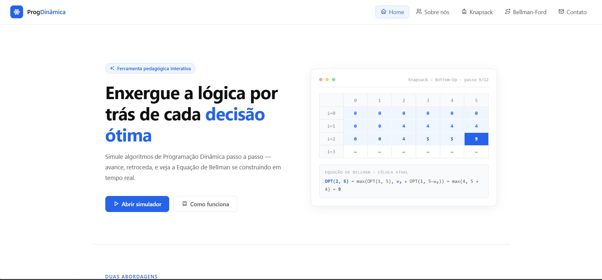
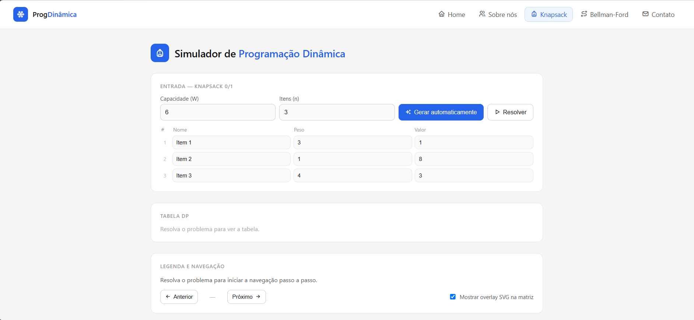
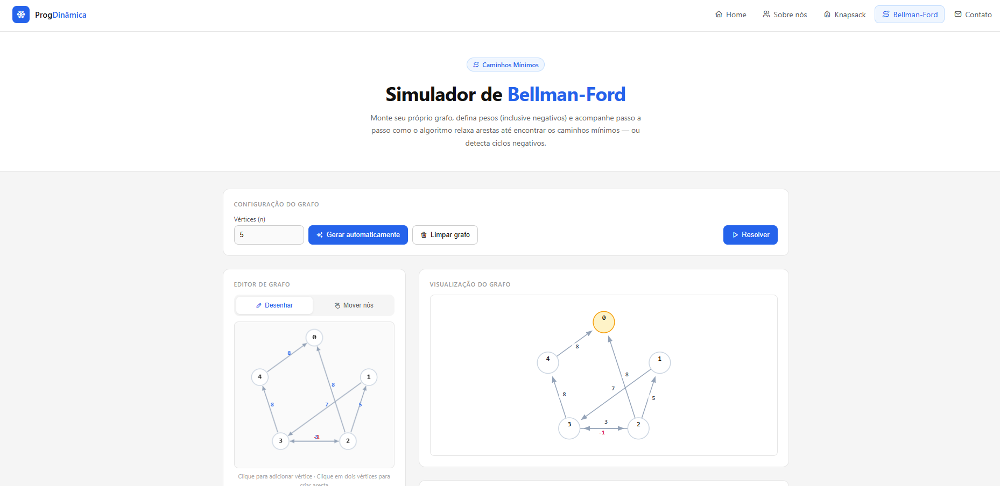
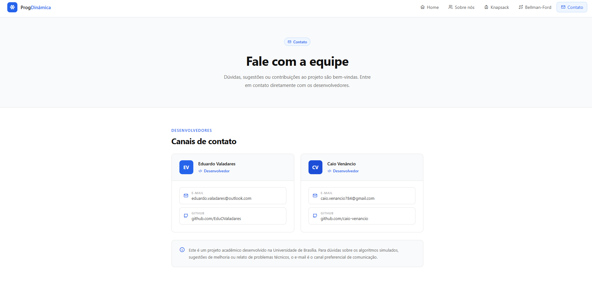

# ProgDinamica

Número da Lista: 61 
Conteúdo da Disciplina: Programação Dinâmica

---

## Alunos

| Matrícula | Aluno |
|-----------|--------|
| 231026311 | Eduardo Valadares |
| 231027195 | Caio Venâncio |

---

## Sobre

Este projeto é uma demonstração interativa de conceitos de Programação Dinâmica, desenvolvida como trabalho de disciplina. Ele reúne:

- Uma página inicial com apresentação do projeto e navegação.
- Um simulador do problema 0/1 Knapsack com visualização em tabela dinâmica, árvore recursiva e navegação por etapas.
- Um simulador do algoritmo Bellman-Ford para caminhos mínimos em grafos, incluindo suporte a arestas com pesos negativos e detecção de ciclos negativos.
- Páginas de Sobre e Contato com informações do grupo.

O código é construído em HTML, CSS e JavaScript puro, sem frameworks externos locais.

## Vídeo

Link do Video: (https://youtu.be/qwzZuwqB3PI)

## Screenshots

A seguir estão capturas da interface do projeto:

- Home: visão geral da página inicial e navegação.
- Knapsack: simulador de 0/1 Knapsack com entrada de itens e tabela DP.
- Bellman-Ford: editor de grafo interativo e tabela de distâncias.
- Contato: página de contato e informações do grupo.









## Instalação

1. Certifique-se de ter um navegador web moderno instalado (Chrome, Firefox, Edge, Safari).
2. Abra a pasta do projeto no explorador de arquivos.
3. Você pode abrir `index.html` diretamente no navegador, ou servir os arquivos localmente com:

```bash
python3 -m http.server 8000
```

4. Acesse `http://localhost:8000` no navegador.

## Uso

1. Abra `index.html` no navegador ou acesse o servidor local.
2. Navegue pelas páginas usando o menu superior.
3. No simulador Knapsack:
   - Informe a capacidade da mochila e o número de itens.
   - Preencha pesos e valores ou use o botão "Gerar automaticamente".
   - Clique em "Resolver" para visualizar a tabela DP e a árvore de decisão.
   - Utilize as setas "Anterior" e "Próximo" para acompanhar o cálculo passo a passo.
4. No simulador Bellman-Ford:
   - Defina o número de vértices e construa o grafo desenhando nós ou criando arestas manualmente.
   - Escolha o vértice fonte.
   - Clique em "Resolver" para observar o relaxamento das arestas e a tabela de distâncias.
   - Se houver ciclo negativo, a interface exibirá o alerta correspondente.
5. Use as páginas "Sobre" e "Contato" para ver informações dos autores.
